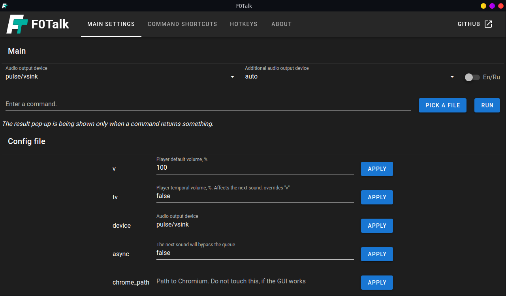
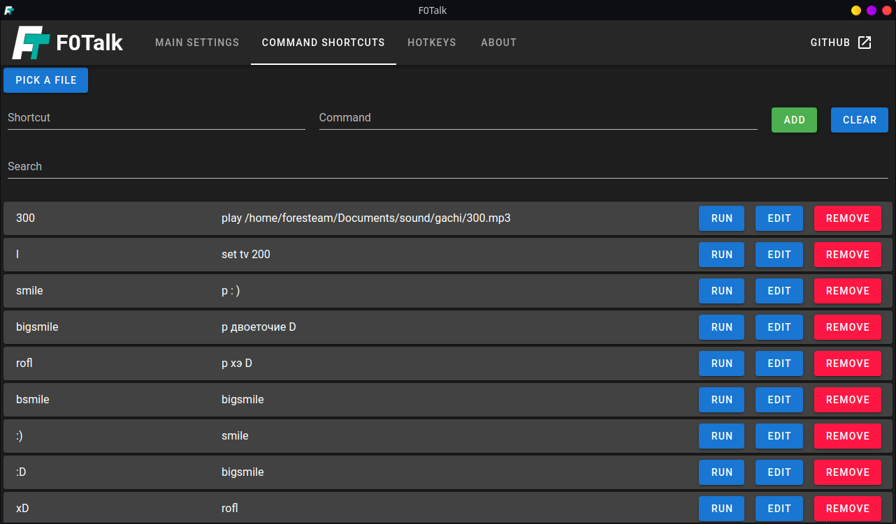

# F0Talk - продвинутый soundboard
## Что это?
Это приложение является продвинутым Soundboard\'ом, позволяющим не просто проигрывать звуки в микрофон, но и "на лету" транслировать текст, преобразованный в речь через GTTS, в указанный в настройках выход звука. Программа может проигрывать звуки как из файлов, так и по URL. Но URL должна быть на YouTube.com (MPV требует для этого youtube-dl) или быть прямой ссылкой на файл. Вообще, приложение может быть использовано и только из терминала, так как GUI - лишь оболочка.




Протестировано на:
* Windows 10 x64
* Linux 5.11.10-1-MANJARO x64

## Установка
Скачайте дистрибутив из секции "releases". Установите Chromium.

#### Windows:
1. Установить MS Visual C++ Redist'ы из папки **msvcr**.
2. Опционально. Установите и настройте [виртуальный кабель](https://vb-audio.com/Cable/) и/или [виртуальный микшер](https://vb-audio.com/Voicemeeter/).
3. Запустите **F0Talk GUI.bat**, или непосредственно **F0Talk.exe**.

#### Linux: 
1. Установите **mpv**, **libxkbcommon-x11** через pacman, apt или как-либо еще.
2. Опционально. Установите **youtube-dl**, если хотите проигрывать медиа напрямую с YouTube (может быть медленне локальных файлов).
3. Опционально. Установите **zenity** или **kdialog** (зависит от вашего DE), если вам нужен графический file picker.
4. Далее, нужно разобраться со звуком. Можете запустить **vsink_t.sh** для получения временного VSink. Если хотите применить эти изменения перманентно, скопируйте содержимое **vsink.txt** в **/etc/pulse/default.pa**.
5. Для запуска в графическом режиме используйте ключ "-g".

Теперь можете выбрать желаемый аудио-выход через GUI приложения. На Linux, вы также можете управлять звуком через **pavucontrol** (например, использовать monitor "auto" как вход другой программы, а сам "auto" - как выход F0Talk)

## Очень краткое руководство по использованию
Находится в программе во вкладке "О программе"

## Сборка
1. Установите Node.JS 14.15.3 и Yarn.
2. Установите все зависимости путем запуска следующей команды в **корне репозитория** и в папке **dev_wgui**:
```
yarn
```

### Debug
В **dev_wgui**, запустите:
```
yarn serve
```
В **корне репозитория**, запустите (-g для GUI):
```
yarn start -g
```

### Release
В **dev_wgui**, запустите:
```
yarn build
```
В **корне репозитория**, запустите:

При сборке **для** Linux **под** Linux:
```
yarn build
```
При сборке **для** Windows под **Linux**:
```
yarn build-win
```
При сборке **для** Windows **под** Windows:
```
yarn winbuild
```